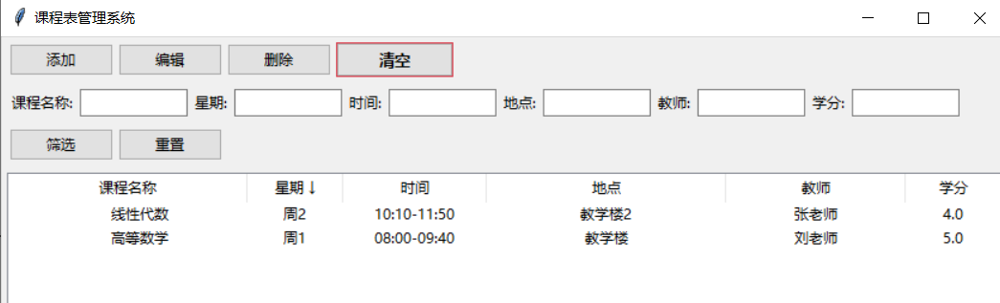

## Course_manager

本项目的目标是帮助大学生管理课程表。

本项目的界面如上。共有六个功能，分别是添加、编辑、删除、清空、筛选和排序。

#### 添加功能

添加功能用于向课程表系统中添加课程。

添加后就可以在下面的表格中看到课程数据。

#### 删除功能

删除功能用于删除掉不需要记录的课程。

选中课程后单击删除按键即可删去课程信息

#### 编辑功能

编辑功能用于修改课程信息。

选中课程后单击修改按键即可修改课程信息

#### 筛选功能

筛选功能用于筛选出课程名称相同、星期相同、时间相同、地点相同、教师相同或者学分同在某一范围内的课程。

例如，现有两门课程：

在学分一栏输入>4，再单击筛选后就可以得到如下结果：

#### 排序功能

排序功能可以对课程按照某个关键字进行排序。

例如按照星期排序：

二进制程序位于dist目录下
